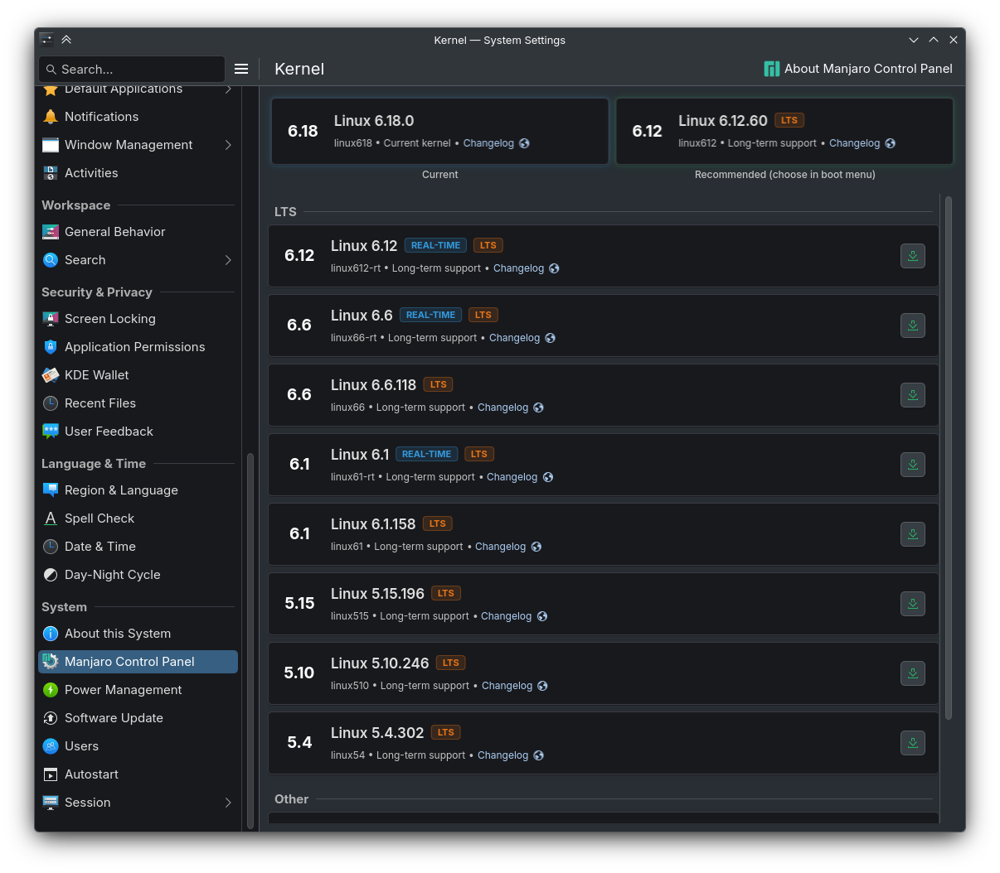
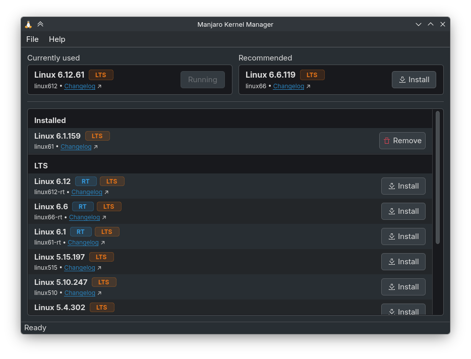
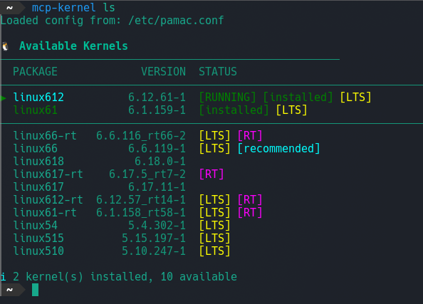

<!--
 Copyright 2025 agrinev.
 SPDX-License-Identifier: GPL-3.0-only
-->

<h1 align="center">
   Manjaro Control Panel
</h1>

<p align="center"><i>"You're in control"</i></p>

## Multi-UI modern settings manager

**Manjaro Control Panel** is a settings manager designed for Manjaro, a modern replacement of the discontinued MSM. It makes it easier for both entry-level and power users to control their system.

The main goal is to fix all MSM flaws, use Qt6/Kirigami and be as user friendly as possible.


## Pages

### Kernels

| Kirigami | Classic | CLI |
|----------|---------|-----|
|  |  |  |

<!--
### Drivers

| Kirigami | Classic | CLI |
|----------|---------|-----|
| [Screenshot] | [Screenshot] | [Screenshot] |
-->

## Features

### Multi-UI

MCP aims to provide a smooth experience for all DEs so you can use:

- KDE System Settings Page
- Classic UI for traditional DEs (such as XFCE)
- CLI

### libpamac usage

MCP uses Pamac library ensuring smooth package transactions in all scenarios.

### Brand-new hardware detection backend

MCP comes with a completely rewritten MHWD (~~Manjaro~~ Modern Hardware Detection) backend, using modern C++ features and new libraries such as libudev.


## Installing

To install MCP using the PKGBUILD:

```bash
cd packaging
makepkg -si
```

This will build and install all MCP packages:
- **libmcp** - Core library
- **libmcp-qt** - Qt/QML shared libraries and transaction agent
- **mcp-qt** - Standalone Qt/QML application
- **mcp-kcm** - KDE System Settings modules


## Contributions

Use GitHub Issues to tell us about a problem. If you have any experience in C++/QML you are welcome to create a Pull Request.

#### Areas where help is needed:

- GTK frontend
- More settings pages
- Translations
- Testing

### Building from sources

#### Dependencies

Install all required dependencies:

```bash
sudo pacman -S cmake ninja git extra-cmake-modules meson vala gobject-introspection \
    qt6-base qt6-declarative kirigami ki18n kcoreaddons kauth kcmutils fmt \
    libsigc++-3.0 libsoup3 qcoro glib2 pamac
```

#### Build Instructions

```bash
cmake -B build -G Ninja \
    -DCMAKE_BUILD_TYPE=Release \
    -DCMAKE_INSTALL_PREFIX=/usr \
    -DMCP_BUILD_LIB=ON \
    -DMCP_BUILD_CLI=ON \
    -DMCP_BUILD_QT=ON \
    -DMCP_BUILD_QT_CLASSIC=ON \
    -DMCP_BUILD_KCM=ON

cmake --build build
```
## License

See LICENSE